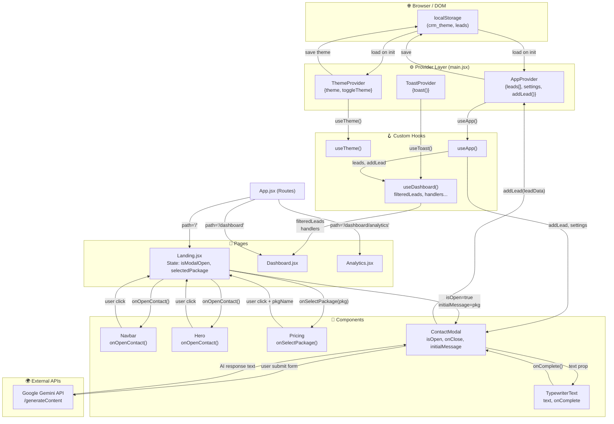

# 📘 WebCRM — Giải Thích Syntax & Data Flow

---

## 1. KIẾN TRÚC TỔNG QUAN — Provider Tree

Nhìn vào `main.jsx`, toàn bộ app được bọc trong các **Provider** lồng nhau:

```jsx
<StrictMode>              // React: kiểm tra lỗi trong dev mode
  <ErrorBoundary>         // Bắt lỗi runtime, hiện fallback UI
    <ThemeProvider>       // Cung cấp theme (dark/light) cho toàn app
      <BrowserRouter>     // React Router: quản lý URL/routing
        <AppProvider>     // Global state: leads, auth, settings
          <ToastProvider> // Hệ thống thông báo toast
            <App />       // Nơi render các Route/Page
          </ToastProvider>
        </AppProvider>
      </BrowserRouter>
    </ThemeProvider>
  </ErrorBoundary>
</StrictMode>
```

**Nguyên tắc:** Provider nào bọc ngoài thì component con bên trong đều có thể dùng data của Provider đó.

---

## 2. KEYWORD GIẢI THÍCH CHI TIẾT

### 📄 `main.jsx` — Điểm khởi động

| Keyword | Giải thích |
|---|---|
| `createRoot` | React 18 API — tạo "gốc rễ" để render app vào DOM |
| `document.getElementById('root')` | Tìm thẻ `<div id="root">` trong `index.html` để gắn app vào |
| `StrictMode` | Wrapper đặc biệt: chạy component 2 lần ở dev để phát hiện bug |
| `BrowserRouter` | Bật hệ thống routing dùng URL thật (history API) |
| `future={{ v7_... }}` | Opt-in feature của React Router v7 để tránh warning |

---

### 📄 `App.jsx` — Định tuyến (Routing)

```jsx
<Routes>
  <Route path="/"          element={<Landing />} />
  <Route path="/login"     element={<Auth type="login" />} />
  <Route path="/dashboard" element={<DashboardLayout />}>
    <Route index           element={<Dashboard />} />      {/* /dashboard */}
    <Route path="analytics" element={<Analytics />} />    {/* /dashboard/analytics */}
  </Route>
</Routes>
```

| Keyword | Giải thích |
|---|---|
| `<Routes>` | Container: chỉ render Route đầu tiên khớp URL |
| `<Route path="...">` | Khai báo: "khi URL = X thì render component Y" |
| `element={<Component/>}` | Component được render khi route match |
| `index` | Route mặc định khi URL là đúng path cha (không có segment thêm) |
| Route lồng nhau | `DashboardLayout` bọc ngoài, các route con render vào `<Outlet/>` bên trong |

---

### 📄 `ThemeContext.jsx` — Context API Pattern

```jsx
// BƯỚC 1: Tạo "kho" rỗng
const ThemeContext = createContext(null);

// BƯỚC 2: Provider — người nắm giữ và cung cấp data
export function ThemeProvider({ children }) {
  const [theme, setTheme] = useState(() => {
    return localStorage.getItem('crm_theme') || 'dark'; // Lazy init
  });

  useEffect(() => {
    document.documentElement.classList.add(theme); // Đồng bộ CSS class vào <html>
    localStorage.setItem('crm_theme', theme);       // Lưu vào browser storage
  }, [theme]); // Chạy lại mỗi khi theme thay đổi

  const toggleTheme = useCallback(() => {
    setTheme(prev => prev === 'dark' ? 'light' : 'dark');
  }, []); // [] = hàm này không bao giờ tạo lại

  return (
    <ThemeContext.Provider value={{ theme, toggleTheme, isDark: theme === 'dark' }}>
      {children}  {/* Render tất cả component con */}
    </ThemeContext.Provider>
  );
}

// BƯỚC 3: Custom Hook — cách lấy data từ context
export const useTheme = () => {
  const ctx = useContext(ThemeContext);
  if (!ctx) throw new Error('...'); // Guard: đảm bảo dùng đúng chỗ
  return ctx;
};
```

| Keyword | Giải thích |
|---|---|
| `createContext(null)` | Tạo một "ống dẫn" để truyền data không qua props |
| `useState(() => ...)` | **Lazy initializer**: hàm chỉ chạy 1 lần lúc mount, tránh đọc localStorage mỗi render |
| `useEffect(fn, [dep])` | "Side effect": chạy `fn` sau mỗi render, nhưng chỉ khi `dep` thay đổi |
| `useCallback(fn, [])` | Ghi nhớ hàm, không tạo lại object mới mỗi render → tránh re-render con |
| `<Context.Provider value={...}>` | Inject data vào tất cả component con bên trong |
| `useContext(ThemeContext)` | Lấy data từ Provider gần nhất bên trên |

---

### 📄 `Landing.jsx` — Page Component

```jsx
export default function Landing() {
  const [isModalOpen, setIsModalOpen] = useState(false);   // State: modal đóng hay mở
  const [selectedPackage, setSelectedPackage] = useState(''); // State: gói nào được chọn

  // Hàm mở modal, có thể kèm theo tên package
  const openContactWithPackage = (pkgName = '') => {
    setSelectedPackage(pkgName);
    setIsModalOpen(true);
  };

  return (
    <div>
      <Navbar onOpenContact={() => openContactWithPackage()} />
      <Hero   onOpenContact={() => openContactWithPackage()} />
      <Pricing onSelectPackage={openContactWithPackage} />  {/* Truyền hàm xuống */}
      
      <ContactModal
        isOpen={isModalOpen}
        onClose={() => setIsModalOpen(false)}
        initialMessage={selectedPackage ? `Đăng ký tư vấn gói: ${selectedPackage}.` : ''}
      />
    </div>
  );
}
```

| Keyword | Giải thích |
|---|---|
| `export default` | Export component để file khác có thể `import` |
| `useState(false)` | Khai báo state: `[giá_trị, hàm_cập_nhật]` |
| `() => openContactWithPackage()` | Arrow function: bọc thêm để không gọi ngay lúc render |
| `onOpenContact={...}` | **Props**: truyền data/hàm từ cha xuống con |
| `pkgName = ''` | Default parameter: nếu không truyền thì mặc định là chuỗi rỗng |

---

### 📄 `ContactModal.jsx` — Component phức tạp nhất

#### State Machine (Máy trạng thái):
```
'form' → 'analyzing' → 'drafting' → 'checkout'(nếu đặt cọc) → 'success'
```

#### Các Hook được sử dụng:

```jsx
// Nhận props từ Landing
export default function ContactModal({ isOpen, onClose, initialMessage = '' }) {

  // State nội bộ
  const [formData, setFormData] = useState({ name: '', email: '', message: '' });
  const [step, setStep]         = useState('form');
  const [aiDraftText, setAiDraftText] = useState('');
  const [isTypingDone, setIsTypingDone] = useState(false);

  // Tham chiếu DOM trực tiếp (không trigger re-render)
  const draftContainerRef = useRef(null);

  // Lấy hàm addLead từ Global Context
  const { addLead, settings } = useApp();
```

| Keyword | Giải thích |
|---|---|
| `{ isOpen, onClose, initialMessage }` | **Destructuring props** — lấy từng prop từ object |
| `useRef(null)` | Tham chiếu DOM node trực tiếp, không gây re-render khi thay đổi |
| `useApp()` | Custom hook — lấy data từ AppContext (addLead, settings) |
| `async/await` | Xử lý bất đồng bộ: đợi API call xong rồi mới chạy tiếp |
| `e.preventDefault()` | Ngăn form submit theo kiểu mặc định của browser (reload trang) |
| `e.stopPropagation()` | Ngăn click event "bọt" lên phần tử cha (backdrop) |

#### AI Call logic:
```jsx
const performAIAnalysis = async (message) => {
  // Thử các model lần lượt
  for (const model of modelsToTry) {
    try {
      const response = await fetch(`https://.../${model}:generateContent?key=${apiKey}`, {
        method: 'POST',
        body: JSON.stringify({ contents: [{ parts: [{ text: prompt }] }] })
      });
      const data = await response.json();
      if (!data.error) return data.candidates[0].content.parts[0].text;
    } catch (e) { /* thử model tiếp theo */ }
  }
  return fallbackData(); // Nếu tất cả fail → dùng mock data
};
```

---

### 📄 `useDashboard.js` — Custom Hook Pattern

```jsx
export function useDashboard() {
  // Lấy data và actions từ global state
  const { leads, updateLeadStatus, deleteLead, ... } = useApp();
  const { toast } = useToast();

  // useMemo: tính toán phức tạp, chỉ tính lại khi dependency thay đổi
  const filteredLeads = useMemo(() => {
    return leads.filter(lead => /* logic lọc */);
  }, [leads, searchTerm, statusFilter, timeFilter]); // Chỉ tính lại khi 4 value này đổi

  // useCallback: ghi nhớ hàm handler, tránh tạo mới mỗi render
  const handleStatusChange = useCallback((id, newStatus) => {
    updateLeadStatus(id, newStatus);
    toast(`Đã chuyển → "${newStatus}"`, 'success');
  }, [updateLeadStatus, toast]); // Dependency: hàm này phụ thuộc vào 2 hàm kia

  // Trả về tất cả state + handlers cho component dùng
  return { filteredLeads, handleStatusChange, ... };
}
```

| Keyword | Giải thích |
|---|---|
| `useMemo(fn, [deps])` | **Memoization**: cache kết quả tính toán, chỉ tính lại khi `deps` thay đổi |
| `useCallback(fn, [deps])` | **Memoization**: cache hàm, không tạo function object mới mỗi render |
| `useEffect` + `window.addEventListener` | Lắng nghe keyboard shortcut (ESC), cleanup khi component unmount |

---

## 3. DATA FLOW DIAGRAM



---

## 4. LUỒNG DỮ LIỆU — Step by Step (Kịch bản người dùng điền form)

```
1. User vào trang "/" → React Router render Landing.jsx
   └── Landing khởi tạo: isModalOpen=false, selectedPackage=''

2. User click "Chọn gói Tăng Trưởng" ở Pricing component
   └── Pricing gọi: onSelectPackage("Gói Tăng Trưởng")
   └── Landing nhận → setSelectedPackage("Gói Tăng Trưởng") + setIsModalOpen(true)

3. Landing re-render → truyền props xuống ContactModal:
   └── isOpen={true}
   └── initialMessage="Đăng ký tư vấn gói dịch vụ: Gói Tăng Trưởng."

4. ContactModal nhận isOpen=true → useEffect chạy:
   └── document.body.style.overflow = 'hidden'  (khoá scroll trang)
   └── setFormData({ message: "Đăng ký tư vấn gói..." })  ← initialMessage điền sẵn
   └── setStep('form')  ← reset về bước đầu

5. User nhập tên, email → onChange cập nhật formData state (controlled input)

6. User click "Phác thảo bằng AI" → handleStartAI():
   └── e.preventDefault()  ← ngăn reload trang
   └── setStep('analyzing')  ← hiện spinner
   └── await performAIAnalysis(formData.message)  ← gọi Gemini API

7. Gemini API trả về text → sau min 1.5s:
   └── setAiDraftText(response)
   └── setStep('drafting')  ← hiện TypewriterText

8. TypewriterText gõ từng ký tự (interval 15ms)
   └── onComplete() → setIsTypingDone(true)  ← hiện nút action

9. User click "Chốt phương án" → handleConfirm():
   └── submitLead():
       └── addLead({ name, email, message, aiDraft })
           └── AppContext cập nhật leads[] state
           └── Lưu vào localStorage
       └── setStep('success')
       └── setTimeout 3s → onClose() → setIsModalOpen(false)

10. Landing re-render: isModalOpen=false → Modal unmount (AnimatePresence animate out)
```

---

## 5. BẢNG TÓM TẮT HOOKS

| Hook | File dùng | Mục đích |
|---|---|---|
| `useState` | Mọi file | Lưu state nội bộ của component |
| `useEffect` | ThemeContext, ContactModal, useDashboard | Side effects: API call, DOM manipulation, event listener |
| `useRef` | ContactModal, TypewriterText | Tham chiếu DOM/giá trị không cần re-render |
| `useContext` | useTheme, useApp, useToast | Lấy data từ Provider gần nhất |
| `useMemo` | useDashboard | Cache kết quả tính toán phức tạp |
| `useCallback` | useDashboard, ThemeContext | Cache hàm handler |
| `createContext` | ThemeContext, AppContext | Tạo "ống dẫn" data |

---

> **💡 Mental Model:** Hãy nghĩ Providers như các "máy chủ điện". ThemeProvider cấp `theme`, AppProvider cấp `leads data`, ToastProvider cấp `toast`. Bất kỳ component con nào cũng có thể "cắm phích" vào qua hook tương ứng (`useTheme`, `useApp`, `useToast`) mà không cần truyền props qua từng tầng.
